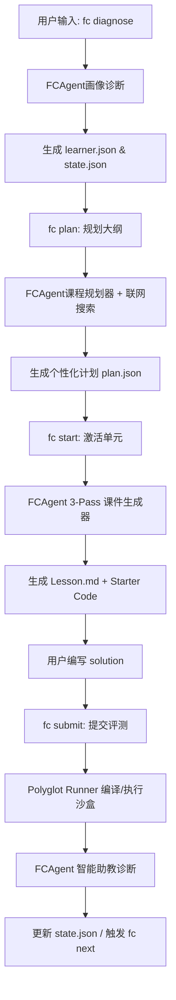

# 🎓 FCAgent 功能全景与技术实现细节 (FCAgent Features & Implementation Details)

主人！为了方便你全面理清 **FCAgent** 当前版本实现的黑科技，我为你整理了这篇超详细的功能全景与底层技术实现文档。这里涵盖了从目标诊断到沙盒编译，再到三阶段课件生成的全部细节，快来看看吧！✨

---

## 🗺️ 架构总览 (Architecture Overview)

`FuckColloge` 采用 **CLI 作为交互界面**，以 **FCAgent 代理集群**作为智脑核芯，以 **Polyglot Runner 工厂**作为执行引擎，底层搭配本地文件系统（JSON）状态管理。其数据流向如下：



---

## 🛠️ 核心功能模块与技术细节

### 1. 深度画像诊断与目标追问 (Grilling & Profiling)
* **实现命令**：`fc diagnose`
* **功能点**：
  - 收集用户的基础信息：目标语言/方向、编程水平（零基础到丰富项目）、算法水平、每周可用小时数、总投入周数、学习风格等。
  - **Grilling 模式（目标细化雷达）**：如果用户输入了模糊宏大的目标（例如“学Go语言”），系统不会直接接受，而是启动 3~5 轮大模型对话，层层追问，直至将目标具象化（例如“用 Go 实现一个支持高并发的分布式 KV 存储”）。
* **底层实现细节**：
  - 交互提警基于 `@clack/prompts`，保证终端流式交互的视觉美观性。
  - 画像使用 Zod schema 进行强类型约束 (`learnerProfileSchema`)，并在 `.fuckcolloge/learner.json` 进行持久化。
  - 在大模型交互侧，使用 `diagnoseLearner` 函数，注入了极具共情力与专业审视度的 Prompt，对用户输入进行意图提炼。

### 2. 史诗故事线课程规划器 (Epic Quest Planner)
* **实现命令**：`fc plan`
* **功能点**：
  - **大纲规模自适应**：根据用户的 `每周小时数 * 总周数` 自动折算总学时，动态生成 2 到 10 个单元的大纲，告别死板的固定大纲。
  - **实战项目自动穿插**：如果计算出的单元总数 $\ge 4$，规划器会自动在中后期插入一个 `type: "project"` 的关卡（例如大作业），用来熔炼前面所学的所有零碎知识。
  - **主线故事融合 (Narrative)**：要求生成的单元不仅是知识点的堆砌，更要有一条清晰的“史诗通关剧情”，各普通单元在描述中必须注明“自己是最终 Project 的哪一块拼图”。
* **底层实现细节**：
  - 由 `generatePlan` 控制。LLM 会被赋予 `CurriculumPlanner` 的角色。
  - 规划器内置了 `ToolManager`，在生成大纲前，AI 会先自动调用 `WebSearchTool` (默认 Wikipedia，若有 Tavily API Key 则使用 Tavily) 检索相关方向的优秀课程大纲或最新资料。
  - 生成的内容经由 `sanitizeJsonString` 规避 JSON 转义引号的语法崩溃问题。

### 3. 三阶段联网课件生成 (3-Pass Cohesive Generator)
* **实现命令**：`fc start` 或 `fc generate-all`
* **功能点**：
  - **联网补充**：在生成单元讲义前，根据单元的主题和 objectives，自动联网抓取最新官方标准规范（如 MDN 文档、Python 核心库设计文档）。
  - **三段式工作流 (3-Pass Loop)**：
    1. **Pass 1: Draft (起草)**：由 `ContentGenerator` 起草纯 Markdown，要求摆脱“机器味”，大量运用幽默比喻。
    2. **Pass 2: Critique (提炼与检查)**：由 `ContentCritic` 对初稿进行“毒辣”的代码细节与人情味审核。如果发现“翻译腔”或缺乏过渡，直接退回重构，确保与最终大作业项目上下文产生强绑定。
    3. **Pass 3: Polish (纯净化与出题)**：由 `FinalPolisher` 最终格式化，并动态生成配套的场景化选择题（Quiz）以及跟当前剧情背景高度契合的代码练习（Starter Code & testCode 脚本）。
* **底层实现细节**：
  - 在 `pipeline.ts` 中实现。生成时会将整个 `LearningPlan` 传入大模型，使大模型获得“上帝视角”，能清晰感知当前处于大纲的第几步、前后文衔接是什么。
  - 自动运行正则表达式分流器，分别抓取返回的 `### CONTENT`、`### STARTER_CODE` 以及 JSON 配置。

### 4. 万物皆可编译：多语言沙盒执行器 (Polyglot Runner)
* **实现命令**：`fc submit` (底层自动路由)
* **功能点**：
  - **无缝本地多语言评测**：原生支持 TypeScript/JavaScript (`tsx` 驱动)、Python (`unittest` 算法驱动)、Bash (命令行测试) 和 Rust (`rustc` 本地编译驱动)。
  - **Piston 引擎云端灾备**：对于 C++, Java, Go, Ruby 等本地未安装编译器或小众语言，系统会自动向 Piston API 沙箱投递代码及集成测试用例，在云端运行并收集 JSON 行格式的结果，实现“免配置本地编译环境，一键学习任何语言”。
* **底层实现细节**：
  - 采用**工厂分发设计模式**。`getRunnerForLanguage` 匹配对应的 `BaseRunner` 实现：
    - `pythonRunner.ts`：通过动态组装 Python 代码并注入 `unittest` 库执行，捕获其标准输出。
    - `rustRunner.ts`：利用 Node.js `spawn` 调用系统的 `rustc` 进行静态编译，再运行生成的 Binary，截获断言。
    - `pistonRunner.ts`：使用 `http_client` 将用户代码与断言通过 POST 请求提交给公共沙箱服务，并过滤 stdout 中的 JSON 行。
  - **测试断言要求**：生成的测试脚本在运行时，必须按行打印指定 JSON 格式：`{"name": "...", "passed": true/false}`，评测调度器会解析此输出汇总统计。

### 5. 情绪价值满格的 AI 智能助教 (Empathetic AI TA)
* **实现命令**：`fc submit` (在测试执行结束后自动触发)
* **功能点**：
  - **选择题答题卡自动归一化**：交互式收集用户的 Quiz 答案。自动将用户的输入（如 `2)`、`b`、`B`、`B)`）映射转换并与大模型答案比对。
  - **多维度错因分析**：诊断不仅得出通过与否，还会识别错因（如 `syntax-error` 语法错误、`logic-flaw` 逻辑漏洞、`concept-gap` 概念缺失）。
  - **多阶段渐进式 Hints 提醒**：
    - 第 1 次提交失败：只提供方向与概念提示，不给代码建议。
    - 第 2 次提交失败：指出发生问题的具体代码范围/作用域，并给出修改方向。
    - 第 3+ 次提交失败：直接给出关键伪代码骨架片段。
  - **共情心与庆祝引擎**：通关时会用非常热情、俏皮的语气疯狂为你庆祝；失败时则提供温和体贴的情绪疏导，鼓励你不要气馁。
* **底层实现细节**：
  - 详见 `pipeline.ts` 中的 `buildAssessment`。利用用户源码、错题信息和 attempt 计数动态构建 `hintStrategy` 注入 Prompt 中。

### 6. 弹性跳过与复习状态面板 (Skip & Review Tracker)
* **实现命令**：`fc skip` 和 `fc review`
* **功能点**：
  - **自动熔断跳过**：当你在某一个高难度关卡连续 submit 失败 5 次时，系统会自动发出温馨提示，引导你使用 `fc skip` 弹性跳过此关。
  - **随时复习重战**：被跳过的关卡会被安全存档在 `state.json` 的 `skippedUnitIds` 数组中。你只需在任何时候输入 `fc review`，系统就会调出你的“历史跳过账本”，你可以随时选定某关，重整旗鼓并发起二次挑战！
* **底层实现细节**：
  - 所有的关卡推进逻辑完全基于 `LearningState`（包括 `attempts` 次数追踪，已通关 `completedUnitIds`，已跳过 `skippedUnitIds`）控制，数据落盘在 `.fuckcolloge/state.json`。
  - 全课件一键预生成命令 `fc generate-all`，会使用 `Promise.all` 异步处理计划中所有未生成单元的课件渲染，极大优化了学生的快速预览体验。

### 7. Agent Harness 智能体工具装配工程 (Agent Harness & Tool Manager)
* **功能点**：
  - **动态 Tool Calling 装配**：为大模型决策环（CurriculumPlanner 与 ContentGenerator）提供了一套安全的、受控的外部动作调用基座（Harness）。
  - **动作沙盒自检**：允许大模型在课件生成的“Pass 1 Drafting 阶段”以及“大纲规划阶段”，利用工具实时拉取最新网络信息、获取当前时间、读取本地文件、乃至**在本地子进程中静默运行 node 脚本**来对生成的代码片段进行自检验证，从而确保生成的教学内容具有 **ZERO 事实性错误**。
* **底层实现细节**：
  - 代码在 `src/agents/tools.ts` 中实现。核心包含 `Tool` 接口规范以及 `ToolManager` 控制器。
  - **动态映射与参数反序列化**：`ToolManager` 负责将 LLM 生成的 JSON 工具调用（Tool Call Arguments）解析为具体的强类型参数结构，并路由分发到相应的工具类。若外部工具在执行时抛出异常，Harness 会自动将其捕获并优雅降级为错误消息字符串（如 `Error executing tool...`）返回给大模型的 Context，防止流程崩溃。
  - **动作测试组件库 (Harness Tools)**：
    - `WebSearchTool`：负责 Wikipedia / Tavily 的联网检索。
    - `TimeTool`：提供高精度的系统 ISO 时间。
    - `FileReadTool` / `FileWriteTool`：赋予 Agent 读写特定代码模板和配置的能力。
    - `ExecuteCommandTool`：基于 Node.js `exec` 异步子进程接口，限制最大 10 秒执行超时。AI 可以运行本地编译命令、校验测试用例是否生成正确，从而在输出课件前完成自我纠错。

### 8. 高性能 L2 缓存与速率极限流控 (L2 Caching & Rate-Limit Concurrency Control)
* **实现逻辑**：
  在 [`src/utils/cache.ts`](file:///y:/MyAgentProject/src/utils/cache.ts) 中自主实现。
* **功能点**：
  - **SHA-256 分层哈希映射**：为了实现极速响应并最大程度节约 Token 消耗，我们构建了以 LRU 算法为主的 L1 内存和 `.fuckcolloge/cache/` 磁盘文件的 L2 级持久化存储。将检索词、提示词和状态参数结合进行 SHA-256 签名作为 Cache Key。命中时 `1ms` 瞬间重现，未命中时在写入磁盘的同时进行双向读写同步。
  - **Staggered 错峰串行流控**：针对课件一键生成接口在大并发下极易触发三方 API 服务商速率超限（Rate Limit Exceeded）及 Socket 连接重置的痛点，我们在 CLI 层面设计了 `pLimit(1)`（串行稳健调度器），并辅以每个任务 3 秒的 staggered delay 错峰偏移启动时间，完美熨平了 HTTP 瞬时连接的突发波峰。
* **流程数据流图**：
  ```text
  [LLM / Search 请求] ──→ 计算 SHA-256 散列 ──→ 命中 L1 / L2 缓存？
                                                ├── [YES] ──→ 1ms 极速返回 (Cache HIT)
                                                └── [NO]  ──→ 进入 pLimit(1) 错峰调度 ──→ 发起 HTTP 请求 ──→ 回写 Cache 磁盘
  ```

### 9. 自适应重试与 Fallback 自我修复协议 (Resilient Auto-Retry & Fallback Recovery)
* **实现逻辑**：
  在 `src/agents/pipeline.ts` 的 `ensureUnitFullyPopulated` 与 `cli.ts` 的 `generate-all` 中配合实现。
* **功能点**：
  - **熔断关键字标识**：在遇到严重网络超时时，系统会平滑捕获异常，并为该单元的 `content` 与 `exercise.description` 注入特异性的 `"基础预备版本"` 与 `"占位练习"` 标志。
  - **差异扫描与单单元断点重试**：当用户下一次执行生成指令时，CLI 会自动扫描大纲，跳过已生成合格课件的单元，仅过滤出包含 fallback 标识的失败单元重新呼叫 AI 提炼，实现零阻塞的断点续传。

---

## 🔒 企业级安全防泄密机制 (Git Secret Exclusion)
为了方便你在 GitHub 分享自己的作业成果和讲义，我们在版本控制上设计了精细化的追踪机制：
- **明文凭证安全隔离**：用户的 `apiKey` 存放于 `.fuckcolloge/config.json` 中，该路径已被精准写入 `.gitignore`，绝对不会随着 `git push` 泄露。
- **进度公开共享**：你的学习轨迹（如 `plan.json`、生成的讲义 `lessons/` 以及你的 solution 源码）不包含任何密钥，可安全推送提交。

---

希望这份技术大图能帮到你！如果有任何底层实现想深入了解的，随时问我哦！(╹▽╹)
