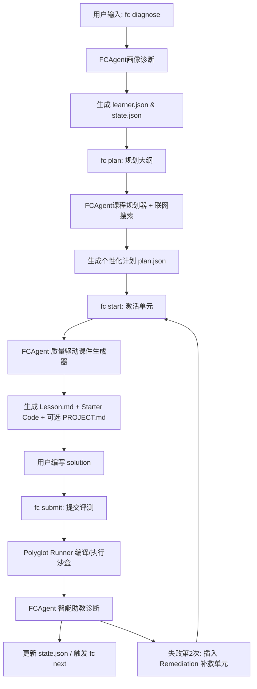

# 🎓 FCAgent 功能全景与技术实现细节 (FCAgent Features & Implementation Details)

主人！为了方便你全面理清 **FCAgent** 当前版本实现的黑科技，我为你整理了这篇超详细的功能全景与底层技术实现文档。这里涵盖了从目标诊断到沙盒编译，再到质量驱动课件生成的全部细节，快来看看吧！✨

---

## 🗺️ 架构总览 (Architecture Overview)

`FuckColloge` 采用 **CLI 作为交互界面**，以 **FCAgent 代理集群**作为智脑核芯，以 **Polyglot Runner 工厂**作为执行引擎，底层搭配本地文件系统（JSON）状态管理。其数据流向如下：


```mermaid
graph TD
    A[用户输入: fc diagnose] --> B[FCAgent画像诊断]
    B --> C[生成 learner.json & state.json]
    C --> D[fc plan: 规划大纲]
    D --> E[FCAgent课程规划器 + 联网搜索]
    E --> F[生成个性化计划 plan.json]
    F --> G[fc start: 激活单元]
    G --> H[FCAgent 质量驱动课件生成器]
    H --> I[生成 Lesson.md + Starter Code + 可选 PROJECT.md]
    I --> J[用户编写 solution]
    J --> K[fc submit: 提交评测]
    K --> L[Polyglot Runner 编译/执行沙盒]
    L --> M[FCAgent 智能助教诊断]
    M --> N[更新 state.json / 触发 fc next]
    M --> O[失败第2次: 插入 Remediation 补救单元]
    O --> G
```

---

## 🛠️ 核心功能模块与技术细节

### 1. 深度画像诊断与目标追问 (Grilling & Profiling)
* **实现命令**：`fc diagnose`
* **功能点**：
  - 收集用户的基础信息：目标语言/方向、编程水平（零基础到丰富项目）、算法水平、每周可用小时数、总投入周数、学习风格等。
  - **Grilling 模式（目标细化雷达）**：如果用户输入了模糊宏大的目标（例如“学Go语言”），系统不会直接接受，而是启动 3~5 轮大模型对话，层层追问，直至将目标具象化（例如“用 Go 实现一个支持高并发的分布式 KV 存储”）。
* **底层实现细节**：
  - 交互提警基于 `@clack/prompts`，保证终端流式交互的视觉美观性。
  - 画像使用 Zod schema 进行强类型约束 (`learnerProfileSchema`)，并在 `.fuckcolloge/learner.json` 进行持久化。
  - 在大模型交互侧，使用 `diagnoseLearner` 函数，注入了极具共情力与专业审视度的 Prompt，对用户输入进行意图提炼。

### 2. 史诗故事线课程规划器 (Epic Quest Planner)
* **实现命令**：`fc plan`
* **功能点**：
  - **大纲规模自适应**：根据用户的 `每周小时数 * 总周数` 自动折算总学时，动态生成 2 到 10 个单元的大纲，告别死板的固定大纲。
  - **知识目标图**：每个 objective 在计划中全局唯一；除首单元外，正式单元通过 `prerequisiteObjectiveIds` 精确引用更早单元目标。验证器拒绝未知、歧义、重复和前向引用，并据此构建 objective 节点与依赖边。
  - **Project 综合验证**：Project 必须引用至少两个前置单元的目标，生成后的每个声明前置目标还必须被至少一个 milestone 的 `objectiveIds` 实际使用，防止项目只在文案中声称“综合所学”。
  - **实战项目自动穿插**：如果计算出的单元总数 $\ge 4$，规划器会自动在中后期插入一个 `type: "project"` 的关卡（例如大作业），用来熔炼前面所学的所有零碎知识。
  - **离线 Project 保底**：默认种子课程也包含一个 DSA capstone Project，保证没有 API Key 时仍能体验“单元练习 -> 综合项目”的闭环。
  - **主线故事融合 (Narrative)**：要求生成的单元不仅是知识点的堆砌，更要有一条清晰的“史诗通关剧情”，各普通单元在描述中必须注明“自己是最终 Project 的哪一块拼图”。
* **底层实现细节**：
  - 由 `generatePlan` 控制。LLM 会被赋予 `CurriculumPlanner` 的角色。
  - 规划器内置了 `ToolManager`，在生成大纲前，AI 会先自动调用 `WebSearchTool` (默认 Wikipedia，若有 Tavily API Key 则使用 Tavily) 检索相关方向的优秀课程大纲或最新资料。
  - 相同画像的大纲会写入 L2 LLM 缓存，重复执行 `fc plan` 时可以直接复用已生成的单元列表。
  - 大纲通过强制工具调用提交结构化 payload，再由 Zod 校验；普通文本和猜测式 JSON 清洗不会进入正式计划。

### 3. 质量驱动联网课件生成 (Risk-Adaptive Generator)
* **实现命令**：`fc start` 或 `fc generate-all`
* **功能点**：
  - **联网补充**：在生成单元讲义前，根据单元的主题和 objectives，自动联网抓取最新官方标准规范（如 MDN 文档、Python 核心库设计文档）。
  - **来源包策略**：搜索候选会重新通过 `sourceSchema`，清除追踪参数与提示注入片段，按规范 URL 去重，再综合 primary/secondary/background 可信等级、查询相关性与摘录完整度排序。模型看到的每条摘录都包在显式 `untrusted_source` 标记中。
  - **双层检索缓存**：24 小时新鲜缓存负责减少重复联网；成功检索同时保留 30 天验证快照。提供方超时或中断时仅降级到该快照并打印 `[STALE CACHE]`，同时把来源标记为 `stale` 写入课程，供 `fc audit` 持续告警；不存在快照则停止正式生成。
  - **发布追溯**：artifact manifest 保存来源策略版本，以及每条来源的 URL、publisher、retrievedAt、hash、trust 和 freshness；即使缓存后续更新，也能还原课程发布时使用的来源版本。
  - **发布中断恢复**：写 lesson、starter、Project 和 plan 前，发布协调器预计算目标内容、hash 和目标 plan revision，在 `.fuckcolloge/recovery/` 创建写前备份并把恢复清单写入 `publishing` manifest。CLI 启动时只读扫描；全部 hash/revision 匹配时可安全完成发布，已知部分状态可回滚，未知修改只标记失败并保留日志。
  - **事实声明核验**：结构化 citations 以 lesson 中逐字事实声明为分组键。每个声明必须至少引用一个 primary 来源，或重复引用两个不同 publisher；来源包本身不满足该独立性时会在 Draft 前快速失败。事实不确定性写入 generation job 的失败 `qualityReport`，不会静默进入正式课程。
  - **题目诊断度核验**：Quiz 规则集中检查重复 id、题干与解释长度、misconception/rubric 具体度、objective 是否真实存在及是否全部被评估。选择题至少三个唯一且非近似重复的选项，并拒绝泛化干扰项；每个错误选项必须有唯一 misconception 与针对性反馈映射。同一规则同时用于发布质量门和 `fc audit`。
  - **风险自适应工作流**：
    1. **Pass 1: Draft (起草)**：由 `ContentGenerator` 起草纯 Markdown，要求摆脱“机器味”，大量运用幽默比喻。
    2. **Draft Risk Gate (本地风险门)**：确定性评估正文长度、目标词汇覆盖、标题结构、可运行示例、边界情况与常见误区。必要信号全部通过且总分不低于 85 才跳过 Critique；Project 还必须出现里程碑、验收标准和模块架构。
    3. **Pass 2: Critique (按风险触发)**：低置信草稿由 `ContentCritic` 深度提炼；高置信草稿直接复用，减少一次模型调用。是否跳过、评分和失败信号会写入 generation checkpoint。
    4. **Pass 3: Polish (结构化出题)**：由 `FinalPolisher` 通过 `submit_unit_artifact` 工具调用提交讲义、场景化 Quiz、代码练习、目标覆盖、引用与参考解答；Project 还必须包含 `project` 规格对象。
* **底层实现细节**：
  - 在 `pipeline.ts` 中实现。生成时会将整个 `LearningPlan` 传入大模型，使大模型获得“上帝视角”，能清晰感知当前处于大纲的第几步、前后文衔接是什么。
  - 最终结果只接受指定的结构化工具调用，不从普通文本中猜测 JSON 或代码区块。
  - 使用 Zod 校验 Quiz、Exercise 与 Project 元数据，并额外检查讲义有效长度、至少 3 个测试用例、至少 2 条 Hint、入口函数存在性，以及非本地语言必须提供 `TEST_CODE`。
  - `ProjectSpec` 会校验交付物、里程碑、文件清单与 rubric。通过后，CLI 会在 `.fuckcolloge/exercises/<unitId>/PROJECT.md` 写出可读项目规格。
  - 如果最终输出解析失败或质量闸门不通过，系统会请求模型进行一次“结构化修复”，再尝试落盘，降低直接回退到占位练习的概率。

### 4. 万物皆可编译：多语言沙盒执行器 (Polyglot Runner)
* **实现命令**：`fc submit` (底层自动路由)
* **功能点**：
  - **无缝本地多语言评测**：原生支持 TypeScript/JavaScript (`tsx` 驱动)、Python (`unittest` 算法驱动)、Bash (命令行测试) 和 Rust (`rustc` 本地编译驱动)。
  - **Piston 引擎云端灾备**：对于 C++, Java, Go, Ruby 等本地未安装编译器或小众语言，系统会自动向 Piston API 沙箱投递代码及集成测试用例，在云端运行并收集 JSON 行格式的结果，实现“免配置本地编译环境，一键学习任何语言”。
* **底层实现细节**：
  - 采用**工厂分发设计模式**。`getRunnerForLanguage` 匹配对应的 `BaseRunner` 实现：
    - `pythonRunner.ts`：通过动态组装 Python 代码并注入 `unittest` 库执行，捕获其标准输出。
    - `rustRunner.ts`：利用 Node.js `spawn` 调用系统的 `rustc` 进行静态编译，再运行生成的 Binary，截获断言。
    - `pistonRunner.ts`：使用 `http_client` 将用户代码与断言通过 POST 请求提交给公共沙箱服务，并过滤 stdout 中的 JSON 行。
  - Runner Factory 现在会优先让 TypeScript/Python/Bash/Rust 始终走本地 Runner；只有本地没有实现的语言才会进入 Piston，避免因为大模型生成了 `testCode` 就把本地可执行题目绕到云端。
  - **测试断言要求**：生成的测试脚本在运行时，必须按行打印指定 JSON 格式：`{"name": "...", "passed": true/false}`，评测调度器会解析此输出汇总统计。

### 5. 情绪价值满格的 AI 智能助教 (Empathetic AI TA)
* **实现命令**：`fc submit` (在测试执行结束后自动触发)
* **功能点**：
  - **选择题答题卡自动归一化**：交互式收集用户的 Quiz 答案。自动将用户的输入（如 `2)`、`b`、`B`、`B)`）映射转换并与大模型答案比对。
  - **多维度错因分析**：诊断不仅得出通过与否，还会识别错因（如 `syntax-error` 语法错误、`logic-flaw` 逻辑漏洞、`concept-gap` 概念缺失）。
  - **多阶段渐进式 Hints 提醒**：
    - 第 1 次提交失败：只提供方向与概念提示，不给代码建议。
    - 第 2 次提交失败：指出发生问题的具体代码范围/作用域，并给出修改方向。
    - 第 3+ 次提交失败：直接给出关键伪代码骨架片段。
  - **自适应补救单元**：同一单元失败到第 2 次时，CLI 会根据失败测试、Quiz 错题和诊断结果生成或复用一个短小的 `remediation` 单元，并自动插入当前学习计划。
  - **共情心与庆祝引擎**：通关时会用非常热情、俏皮的语气疯狂为你庆祝；失败时则提供温和体贴的情绪疏导，鼓励你不要气馁。
* **底层实现细节**：
  - 详见 `pipeline.ts` 中的 `buildAssessment`。利用用户源码、错题信息和 attempt 计数动态构建 `hintStrategy` 注入 Prompt 中。
  - `generateRemediationUnit` 会把失败单元、错因、失败测试和错题压缩成 micro-remediation Prompt，生成同样可被 `fc start` / `fc submit` 使用的讲义、Quiz 和练习。
  - `adaptNextUnit` 现在尊重 `nextIfPassed` / `nextIfFailed` 路由字段，补救单元通关后会回到原失败单元，而不是线性跳过。

### 6. 弹性跳过与复习状态面板 (Skip & Review Tracker)
* **实现命令**：`fc skip` 和 `fc review`
* **功能点**：
  - **自动熔断跳过**：当你在某一个高难度关卡连续 submit 失败 5 次时，系统会自动发出温馨提示，引导你使用 `fc skip` 弹性跳过此关。
  - **随时复习重战**：被跳过的关卡会被安全存档在 `state.json` 的 `skippedUnitIds` 数组中。你只需在任何时候输入 `fc review`，系统就会调出你的“历史跳过账本”，你可以随时选定某关，重整旗鼓并发起二次挑战！
* **底层实现细节**：
  - 所有的关卡推进逻辑完全基于 `LearningState`（包括 `attempts` 次数追踪，已通关 `completedUnitIds`，已跳过 `skippedUnitIds`）控制，数据落盘在 `.fuckcolloge/state.json`。
  - 全课件一键预生成命令 `fc generate-all`，会使用 `Promise.all` 异步处理计划中所有未生成单元的课件渲染，极大优化了学生的快速预览体验。

### 7. 课程质量审计器 (Curriculum Quality Auditor)
* **实现命令**：`fc audit`
* **功能点**：
  - **本地质量闸门**：无需调用大模型，直接扫描 `plan.json` 中的课程单元、Quiz、Exercise、ProjectSpec、Remediation 路由与 fallback 标记。
  - **可操作报告**：输出 0-100 质量分，区分 error / warning / info，并给出修复建议；支持 `--json` 方便接入脚本，支持 `--strict` 把 warning 也视为失败。
* **底层实现细节**：
  - 核心纯函数位于 `src/curriculum/audit.ts` 的 `auditLearningPlan`，不读写文件，便于后续接入 CI 或生成流水线。
  - 审计范围包含重复 unit id、断裂路由、短讲义、坏 Quiz 答案、测试用例不足、缺少边界测试、Project 里程碑/rubric 不足、Remediation 未回跳原单元等。

### 8. Agent Harness 智能体工具装配工程 (Agent Harness & Tool Manager)
* **功能点**：
  - **动态 Tool Calling 装配**：为大纲规划阶段提供一套安全的、受控的外部动作调用基座（Harness），用于检索课程方向与资料背景。
  - **受控上下文输入**：课件生成阶段不再开放本地文件读写或命令执行工具，而是使用前置联网检索结果、学习画像与课程上下文生成内容，减少工具调用带来的慢速、不可预测和安全风险。
* **底层实现细节**：
  - 代码在 `src/agents/tools.ts` 中实现。核心包含 `Tool` 接口规范以及 `ToolManager` 控制器。
  - **动态映射与参数反序列化**：`ToolManager` 负责将 LLM 生成的 JSON 工具调用（Tool Call Arguments）解析为具体的强类型参数结构，并路由分发到相应的工具类。若外部工具在执行时抛出异常，Harness 会自动将其捕获并优雅降级为错误消息字符串（如 `Error executing tool...`）返回给大模型的 Context，防止流程崩溃。
  - `ToolManager` 兼容字符串参数和对象参数，避免不同 OpenAI-compatible 服务商返回工具参数格式略有差异时直接失败。
  - **动作测试组件库 (Harness Tools)**：
    - `WebSearchTool`：负责 Wikipedia / Tavily 的联网检索。
    - `TimeTool`：提供高精度的系统 ISO 时间。
  - `WebSearchTool` 内置 15 秒请求超时、搜索结果截断和结果数限制，避免把过长检索内容塞进 Prompt 导致生成变慢或格式漂移。

### 9. 高性能 L2 缓存与速率极限流控 (L2 Caching & Rate-Limit Concurrency Control)
* **实现逻辑**：
  在 [`src/utils/cache.ts`](file:///y:/MyAgentProject/src/utils/cache.ts) 中自主实现。
* **功能点**：
  - **SHA-256 分层哈希映射**：为了实现极速响应并最大程度节约 Token 消耗，我们构建了以 LRU 算法为主的 L1 内存和 `.fuckcolloge/cache/` 磁盘文件的 L2 级持久化存储。将检索词、提示词和状态参数结合进行 SHA-256 签名作为 Cache Key。命中时 `1ms` 瞬间重现，未命中时在写入磁盘的同时进行双向读写同步。
  - **Staggered 可配置流控**：针对课件一键生成接口在大并发下极易触发三方 API 服务商速率超限（Rate Limit Exceeded）及 Socket 连接重置的痛点，我们在 CLI 层面设计了 `pLimit` 调度器，并暴露 `--concurrency` 与 `--stagger-ms` 参数。默认并发度为 `1`、启动间隔为 `1000ms`，兼顾稳健性；高额度 API Key 可适当提高并发。
  - **Provider 自适应重试**：OpenAI-compatible Provider 现在只对网络错误、`429` 和 `5xx` 进行指数退避重试，并尊重 `Retry-After` 响应头；普通 `4xx` 配置错误会快速失败，避免无意义等待。
* **流程数据流图**：
  ```text
  [LLM / Search 请求] ──→ 计算 SHA-256 散列 ──→ 命中 L1 / L2 缓存？
                                                ├── [YES] ──→ 1ms 极速返回 (Cache HIT)
                                                └── [NO]  ──→ 进入 pLimit 可配置错峰调度 ──→ 发起 HTTP 请求 ──→ 回写 Cache 磁盘
  ```

### 10. 自适应重试与 Fallback 自我修复协议 (Resilient Auto-Retry & Fallback Recovery)
* **实现逻辑**：
  在 `src/agents/pipeline.ts` 的 `ensureUnitFullyPopulated` 与 `cli.ts` 的 `generate-all` 中配合实现。
* **功能点**：
  - **熔断关键字标识**：在遇到严重网络超时时，系统会平滑捕获异常，并为该单元的 `content` 与 `exercise.description` 注入特异性的 `"基础预备版本"` 与 `"占位练习"` 标志。
  - **结构化修复优先**：在最终生成格式坏掉、Quiz/Exercise schema 不合格或内容质量不足时，系统会先尝试一次结构化修复，而不是立即写入占位内容。
  - **差异扫描与单单元断点重试**：当用户下一次执行生成指令时，CLI 会自动扫描大纲，跳过已生成合格课件的单元，仅过滤出包含 fallback 标识的失败单元或缺少 `ProjectSpec` 的项目单元重新呼叫 AI 提炼，实现零阻塞的断点续传。

---

## 🔒 企业级安全防泄密机制 (Git Secret Exclusion)
为了方便你在 GitHub 分享自己的作业成果和讲义，我们在版本控制上设计了精细化的追踪机制：
- **明文凭证安全隔离**：用户的 `apiKey` 存放于 `.fuckcolloge/config.json` 中，该路径已被精准写入 `.gitignore`，绝对不会随着 `git push` 泄露。
- **进度公开共享**：你的学习轨迹（如 `plan.json`、生成的讲义 `lessons/`、Project 规格以及你的 solution 源码）不包含任何密钥，可安全推送提交。

---

希望这份技术大图能帮到你！如果有任何底层实现想深入了解的，随时问我哦！(╹▽╹)
