# 课程生成质量、速度与稳定性优化重构建议

> 审查分支：`codex-course-generation-optimization`
> 审查日期：2026-07-10
> 最后状态核对：2026-07-14（批量内容预览稳定性回归后）
> 结论取向：**质量与稳定性优先；任何提速不得降低已验证内容的质量门槛。**
>
> **阅读说明**：第 1～10 节保留初版审查时的证据和建议；其中部分问题已经修复。当前真实状态以第 11 节的实施证据和第 12 节的 A～I 状态矩阵为准。

## 1. 执行摘要

FCAgent 已经具备个性化诊断、课程大纲、三阶段课件生成、练习运行、补救路由、项目规格和本地审计等关键能力；当前最大的风险不在于“功能不够多”，而在于**生成结果是否可信、是否可恢复、是否会破坏学习者正在完成的成果**。

初版仅审查当时的分支代码、已有文档和本地学习产物；后续实现始终不修改 `.fuckcolloge/` 下的现有学习数据和缓存。建议把“生成成功”定义为：内容、题目、练习和项目规格都通过可执行质量门槛，并且能够安全、可追溯地发布。随后再以复用、并发和模型调用削减提升速度。

### 已验证基线（2026-07-10，历史）

| 项目           | 结果                                                            | 含义                                                               |
| -------------- | --------------------------------------------------------------- | ------------------------------------------------------------------ |
| 当前分支       | `codex-course-generation-optimization`                        | 本报告针对该分支，不比较未合入的本地修改。                         |
| 类型检查       | `npm.cmd run typecheck` 通过                                  | 当前`src/` 可被 TypeScript 编译器检查。                          |
| 课程审计       | `npm.cmd run dev -- audit --json`：72/100、0 error、7 warning | 现有审计能发现部分结构问题，但“通过”不代表教学内容已达质量要求。 |
| 自动化测试入口 | `package.json` 无 `test` 脚本                               | `tests/` 以手工、网络依赖和演示脚本为主，缺少可重复的回归门槛。  |
| 现有学习数据   | `.fuckcolloge/` 中存在未跟踪课程、练习和缓存                  | 必须视为学习者数据；重构不能清理、覆盖或将其纳入提交。             |

### 优先做的五件事

1. **P0：把发布状态显式化，并用原子写入保护计划、状态和学习者答案。** 不再把低质量 fallback 当作已完成课程；重复运行 `start` / `generate-all` 不得覆盖 `solution.*`。
2. **P0：以提供方结构化输出和 Zod 校验替换正则提取、`sanitizeJsonString` 与“猜测式修复”。** 结构错误应成为可恢复的作业失败，而不是静默变形的课程数据。
3. **P1：把“教学质量”从字数、题数升级为目标覆盖、来源可追溯、题目诊断性和参考解答实跑。**
4. **P2：建立版本化语义缓存、请求合并和提供方感知调度。** 先减少重复工作，再谨慎提高并发。
5. **P3：把生成编排从 `pipeline.ts` 和 `cli.ts` 中深化为独立模块，并补齐可离线、确定性的测试体系。**

---

## 2. 当前链路与问题证据

### 2.1 当前生成与发布流

```mermaid
flowchart LR
    A[学习者画像] --> B[generatePlan]
    B --> C[plan.json]
    C --> D[start / generate-all]
    D --> E[WebSearchTool]
    E --> F[Pass 1 Draft]
    F --> G[Pass 2 Critique]
    G --> H[Pass 3 Polish + JSON]
    H --> I[正则提取 / JSON 清洗 / Zod]
    I -->|成功| J[同步写 plan + lesson + solution]
    I -->|失败| K[一次修复或基础占位内容]
    K --> J
    J --> L[submit]
    L --> M[本地或 Piston 运行器]
    M --> N[assessment / remediation]
```

### 2.2 关键事实

| 观察                                                                             | 代码证据                                                                                   | 后果                                                                           |
| -------------------------------------------------------------------------------- | ------------------------------------------------------------------------------------------ | ------------------------------------------------------------------------------ |
| 生成编排、解析、质量检查、补救、测验评分和评估都位于一个文件                     | `src/agents/pipeline.ts` 约 1,406 行                                                     | 调整提示词、重试或质量门槛时容易影响不相关行为；局部性不足。                   |
| CLI 同时承担交互、流程编排、文件发布、限流、状态推进和展示                       | `src/cli.ts` 约 1,122 行                                                                 | 用命令行行为验证核心逻辑，测试成本高；同一规则容易在命令间漂移。               |
| 单元输出通过代码块/最后花括号定位和`sanitizeJsonString` 修复                   | `pipeline.ts` 的 `parseJsonFromText`、`extractJsonCandidate`、`sanitizeJsonString` | 模型输出稍有嵌套、代码块或引号变化，便可能取到错误片段；错误并非总能可靠修复。 |
| 大纲在映射默认字段后缓存，未先以`seedUnitSchema` / `planSchema` 验证全部约束 | `generatePlan` 的大纲解析路径                                                            | 重复 id、错误路由、空目标等问题可延后到运行或审计阶段才暴露。                  |
| fallback 单元仅有短课文、1 个测试和 1 条提示                                     | `ensureUnitFullyPopulated`                                                               | 与正常生成所要求的 400 字、3 测试、2 提示不一致；但会被写入并呈现给学习者。    |
| `start` 与 `generate-all` 无条件把 `starterCode` 写入 `solution.*`       | `writeGeneratedUnitArtifacts`                                                            | 用户重新打开单元或批量预生成时可能丢失已写答案。                               |
| 计划、状态、缓存和产物均直接覆盖写入                                             | `fsState.ts`、`cache.ts`                                                               | 进程中断、磁盘错误或多进程并发会留下半写文件、旧状态或最后写者覆盖。           |
| 缓存键未统一包含模型、提示词、schema、检索来源版本                               | `generatePlan`、`generateUnitContent`、`CacheManager`                                | 调整提示词或换模型后仍可能命中旧结果；不同输入也可能共享过粗的缓存。           |
| 三个长文本阶段固定串行执行                                                       | `generateUnitContent`                                                                    | Pass 2 复述长草稿，Pass 3 再传入全文，延迟与 token 成本随单元长度放大。        |
| 运行器直接在本机执行学习者代码                                                   | `typescriptRunner.ts`、`pythonRunner.ts`、`bashRunner.ts`、`rustRunner.ts`         | 5 秒超时不是安全隔离；恶意或失控代码仍可能读取工作目录、子进程环境或消耗资源。 |
| 质量审计主要检查长度、字段、路由和测试名称                                       | `curriculum/audit.ts`                                                                    | 它不能确认事实正确、目标被讲清、答案可运行或题目真的能区分掌握程度。           |

### 2.3 当前审计暴露的具体缺口

本地 `fc audit --json` 得到 7 项 warning：一个单元的测试数量不足、项目单元缺少 `ProjectSpec`，以及多个单元仅凭测试名称无法识别边界测试。这说明审计有价值，但其 72/100 的“通过”不能被当作发布许可。

建议把审计结果分为两个概念：

- **结构审计**：字段、路由、长度、文件完整性；适合作为快速本地检查。
- **发布质量评估**：目标覆盖、来源、练习可执行性、题目质量、项目验收标准；只有它通过，单元才可标记为 `published`。

---

## 3. 目标架构与不可妥协的原则

### 3.1 目标流

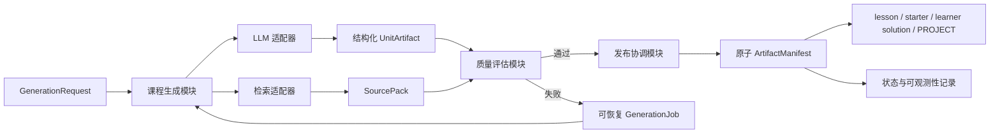

### 3.2 设计原则

1. **未通过质量门槛的内容不能伪装成完成内容。** 离线种子可被明确标记为 `offline`，但不能与 `published` 混淆。
2. **生成是可重试作业，发布是事务。** 模型调用、检索和评估允许失败；对学习者可见文件只能在全部校验完成后原子发布。
3. **学习者答案是主数据。** `solution.*` 一旦存在即默认不可覆盖；生成器只更新 lesson、starter 模板或版本化候选产物。
4. **事实与推理分离。** 检索内容只作为带来源、可截断、不可执行的 `SourcePack`；任何来源文本都不得改变系统指令。
5. **质量优先于“多轮”。** 三阶段本身不是质量证明；质量必须由可检查的输入、规则和执行结果决定。
6. **接口应小而深。** 外层调用者只提出生成请求和读取结果；解析、重试、缓存、校验和发布复杂度集中在课程生成模块，获得更高杠杆与局部性。

### 3.3 建议的作业状态

| 状态                                          | 含义                                 | 可否展示给学习者         | 可否发布正式产物   |
| --------------------------------------------- | ------------------------------------ | ------------------------ | ------------------ |
| `planned`                                   | 已生成大纲，尚未生成单元             | 可以展示大纲             | 否                 |
| `retrieving` / `drafting` / `reviewing` | 正在执行某一生成阶段                 | 仅显示进度               | 否                 |
| `validating`                                | 结构、教学、代码质量正在检查         | 仅显示进度               | 否                 |
| `published`                                 | 全部质量门槛通过，产物已原子落盘     | 是                       | 是                 |
| `offline`                                   | 明确的种子课程或离线样例             | 是，必须显示离线标识     | 仅作为离线学习样例 |
| `degraded`                                  | 可读但未达到正式门槛的候选           | 可选择预览，必须标识原因 | 否                 |
| `failed`                                    | 有结构化失败原因，等待恢复或人工操作 | 显示可执行提示           | 否                 |

---

## 4. 重点重构候选

以下每项使用相同判断模板：问题、解决方案、局部性/杠杆、测试影响与推荐强度。术语中的模块、接口、实现、接缝、适配器、深度、杠杆和局部性用于描述重构取舍。

### 候选 A：深化课程生成模块，缩薄 CLI

**推荐强度：Strong（P0/P3）**

**问题**

`pipeline.ts` 集中了承担大纲、检索、三阶段生成、结构恢复、质量检查、测验评分、评估和补救的实现；`cli.ts` 又承担持久化、批量调度、文件发布和交互。删除其中任一模块后，复杂度并不会消失，而是会分散到多个命令调用点，说明当前接口过宽、局部性不足。

**解决方案**

建立一个深的“课程生成模块”，让外部接口只接收请求、返回作业和已发布产物；将以下实现放在该模块内部的接缝之后：检索、提示词阶段、结构校验、质量评估、重试、缓存查询和恢复。CLI 变成命令行适配器，只负责把输入转换为请求、显示作业状态和调用发布动作。

建议先在设计文档中固定这些概念，而不立即锁死 TypeScript 签名：

- `GenerationRequest`：学习者画像、课程单元、生成策略和显式版本。
- `GenerationJob`：job id、状态、阶段耗时、错误、恢复点和尝试次数。
- `UnitArtifact`：课程内容、题目、练习、项目规格、来源包、质量报告。
- `ArtifactManifest`：已发布文件的 hash、版本、生成作业和保护策略。

**当前/目标图**

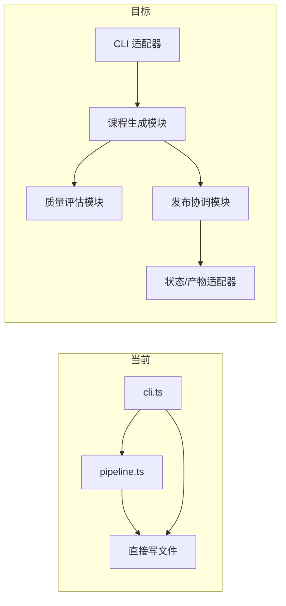

**局部性与杠杆**

重试、fallback、缓存和发布规则只在一个实现位置维护。未来新增 Web、桌面或批处理适配器时，不需要复制生成规则；测试也可直接跨越生成模块的接口。

**测试影响**

为生成模块提供 fake LLM、fake 检索和内存状态适配器；CLI 测试退化为少量命令映射与输出测试。

---

### 候选 B：用提供方结构化输出取代正则解析和 JSON 清洗

**推荐强度：Strong（P0）**

**问题**

当前最终输出把 JSON、Markdown、starter code 与可选 test code 放在同一文本中，再通过正则、首尾括号和字符串清洗恢复。这是格式脆弱点：代码中的花括号、嵌套 JSON、额外解释或截断都可能令解析取错候选。一次 repair 失败后会降级到低质量内容。

**解决方案**

在 LLM 适配器的接口中声明“结构化响应能力”：支持的提供方使用 JSON Schema/response format 或 function tool 直接返回 `UnitArtifact` 元数据；正文与代码使用明确字段而非 Markdown 分段。对于不支持结构化响应的适配器，保留一个受限的 codec：只接受单一 JSON 文档、使用严格 schema 验证、记录原始响应 hash，并以确定性解析失败结束作业。

将 repair 从“把原文本再次塞进提示词”改为“输入字段级校验错误 + 原始结构化字段”，最多一次；仍失败则状态为 `failed`/`degraded`，不发布为正式课程。

**当前/目标图**

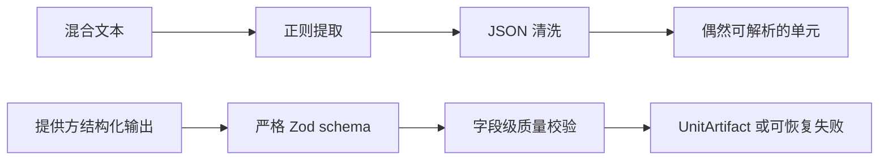

**局部性与杠杆**

格式兼容性被封装在 LLM 适配器与 codec 接缝中，课程生成模块只处理已验证数据。提示词改版不再让各调用点承担解析例外。

**测试影响**

增加 fixture：合法结果、缺字段、截断、包含代码花括号、无效枚举、提供方拒绝 schema；确保每个失败都产生确定的 `GenerationJob` 状态而非占位发布。

---

### 候选 C：发布事务、原子持久化与学习者答案保护

**推荐强度：Strong（P0）**

**问题**

`writeJson`、`writeTextFile` 和缓存写入都直接覆盖目标文件；批量生成同时更新共享计划。更严重的是，`writeGeneratedUnitArtifacts` 每次都会覆盖 `solution.*`。这既会破坏学习者答案，也使中断恢复依赖内容中的中文占位字样。

**解决方案**

1. 所有 JSON、课程和项目文件先写入同目录临时文件，`fsync` 后以 rename 原子替换；失败时保留临时清单供恢复，而不是损坏原文件。
2. 发布协调模块以 `ArtifactManifest` 记录每个单元的 job id、输入 hash、产物 hash、状态和时间；只允许一个 writer 持有课程计划锁。
3. 把 `starterCode` 写入 `starter.<ext>` 或版本化模板；仅当 `solution.<ext>` 不存在时初始化答案文件。新增明确的 `--reset-solution` 才允许覆盖，并要求交互确认或 `--yes`。
4. `generate-all` 以每单元独立作业发布；一个作业失败不取消已成功单元，也不把失败标为生成完成。

**当前/目标图**

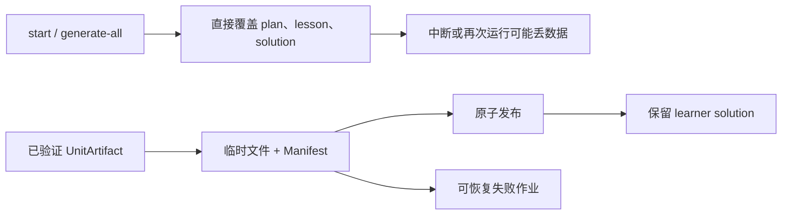

**局部性与杠杆**

所有写入语义集中在发布协调模块和状态适配器，命令不再各自决定何时覆盖。一次实现可保护 `start`、`generate-all`、补救和未来的 Web 适配器。

**测试影响**

注入写入失败和进程中断；验证旧 `plan.json`/`solution.*` 保持可读、manifest 能恢复、并发发布只有一个获胜者、无 `--reset-solution` 时答案 hash 不变。

---

### 候选 D：把教学质量门槛升级为可验证的学习闭环

**推荐强度：Strong（P1）**

**问题**

当前 `assertGeneratedUnitQuality` 主要检查最小字数、测试数、提示数、入口名和项目字段；`auditLearningPlan` 再检查路由与结构。这些条件必要但不足：长文本仍可能没有解释目标，三道测试也可能重复，测验正确答案也可能无法诊断误解。

**解决方案**

为课程大纲引入可追踪的学习目标图：每个目标包含概念标签、先修目标、认知层级、可观察证据和项目关联。每个 `UnitArtifact` 需将 lesson 段落、worked example、quiz、exercise test 与目标 id 映射。

发布质量评估至少检查：

- 每个目标在讲解、示例和评估中均被覆盖；没有仅“列出”却未解释的目标。
- lesson 至少包含定义、带步骤的例子、常见误解/边界条件、回忆或迁移问题。
- quiz 选项拥有明确的误解标签；短答题拥有 rubric，而非仅精确字符串相等。
- exercise 具有正常、边界、反例/误解守卫三类测试，并能说明每类测试对应的目标。
- project 的里程碑、验收标准和 rubric 与前置目标一致，不只是营销式描述。
- 质量报告记录每项门槛及未通过原因，供补救生成和人工复查使用。

**当前/目标图**

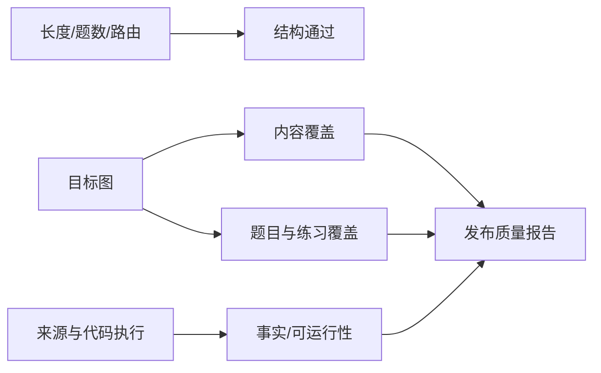

**局部性与杠杆**

教学规则集中于质量评估模块，提示词只提供输入；不同模型或生成策略都可复用同一质量口径。未来改写课程风格不必重写评分规则。

**测试影响**

建立覆盖不足、错误先修、重复干扰项、无边界测试、项目验收脱节的课程 fixture；把质量报告快照作为 golden regression。

---

### 候选 E：建立可靠来源包、引用与检索防护

**推荐强度：Strong（P1）**

**问题**

单元检索目前将 Wikipedia/Tavily 返回的摘要拼接为普通提示词文本。搜索结果没有来源等级、抓取时间、内容 hash、事实使用记录或引用输出；网页文本也可能携带与课程生成无关的指令。

**解决方案**

1. 由检索适配器输出结构化 `SourcePack`：url、标题、发布者、抓取时间、摘要、hash、可信等级、适用目标和允许引用的片段。
2. 技术课程默认优先官方文档、标准、语言/框架维护方资料；百科只作术语背景，不作为易变技术事实的唯一依据。
3. 在 lesson 中生成“参考来源”小节，引用实际使用的 `SourcePack`，并在 manifest 中记录来源版本。
4. 以不可信数据通道传递检索片段：明确声明其只能提供事实线索、不能覆盖系统要求；截断、清洗 HTML，拒绝包含明显指令注入的片段。
5. 对时效性较高的目标标记来源新鲜度；超过阈值则让作业重新检索，而不是无期限命中缓存。

**当前/目标图**

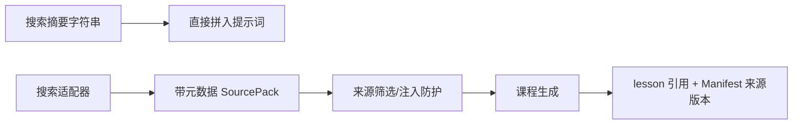

**局部性与杠杆**

来源策略位于检索适配器接缝；切换 Wikipedia、Tavily 或新增官方文档检索时，课程生成模块和质量评估模块无需感知底层 HTTP 细节。

**测试影响**

使用离线检索 fixture 验证：来源排序、截断、缓存失效、注入片段拒绝、引用与来源包一一对应。

---

### 候选 F：验证生成练习的可运行性，并隔离执行风险

**推荐强度：Strong（P1，安全前置）**

**问题**

当前练习元数据通过 schema 后即可发布，但生成器不会验证一份参考解答是否真的通过测试。学习者提交代码时，本地运行器会直接执行 `solution.*`；超时只能限制时长，不能提供文件、网络或进程隔离。测试也由元数据即时写为可见文件。

**解决方案**

1. 生成阶段额外输出仅供验证的 `referenceSolution`，不写入学习者目录；质量评估在受控运行器中确认它编译/解释成功并通过所有测试。
2. 将测试区分为可见练习测试与验证测试。若产品需要反作弊，验证测试必须在远程受控运行器中执行；本地文件不能被视为真正隐藏。
3. 把执行模式明确为 `trusted-local`、`restricted-local`、`remote-sandbox`。默认本地模式至少使用临时工作区、最小环境变量、资源限制、禁止继承敏感配置，并清理子进程。
4. 对 TypeScript、Python、Bash、Rust 分别建立 runner contract fixture；Piston 适配器需有超时、错误分类和运行时缓存。

**当前/目标图**

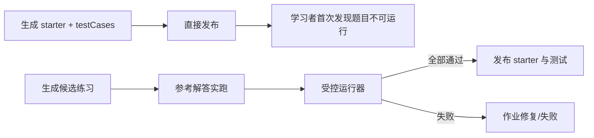

**局部性与杠杆**

运行器能力由统一接口表达，生成模块只关心“验证是否通过”。增加语言时只增加一个适配器和其 fixture，不在提示词、CLI 和评分逻辑中分散特例。

**测试影响**

验证参考解答成功、语法失败、超时、错误 JSON 输出、空测试、错误入口名、进程环境最小化和临时目录清理。

---

### 候选 G：版本化缓存、请求合并与质量守恒提速

**推荐强度：Strong（P2）**

**问题**

当前缓存使用 SHA-256 文件名，但 key 的组成在不同阶段各自定义。单元缓存键不完整地覆盖学习者画像，也不包含模型、温度、提示词版本、schema 版本和来源版本；同一请求并发到达时会重复调用模型。固定的三次长输出又使生成延迟和成本偏高。

**解决方案**

1. 定义规范 cache key：`artifact kind + canonical request + provider/model + prompt version + schema version + source pack hash + generation policy`。JSON 必须按稳定键序列化。
2. 采用分阶段缓存：大纲、检索来源包、草稿、评审意见、最终 artifact 分开缓存；只复用输入版本完全相同的阶段。
3. 为每个 key 实现 single-flight：一个请求在运行时，其余相同请求等待同一 promise/作业结果，而不是重复消耗额度。
4. Pass 2 改为结构化“问题与修改建议”，不再输出完整扩写正文；Pass 3 仅消费草稿与精简评审。通过强确定性检查且风险低的单元可跳过额外修复，但不能跳过发布质量评估。
5. 缓存支持容量上限、TTL、命中来源、失效原因和原子写入；损坏缓存应记录并重建，而不是静默吞掉。

**当前/目标图**

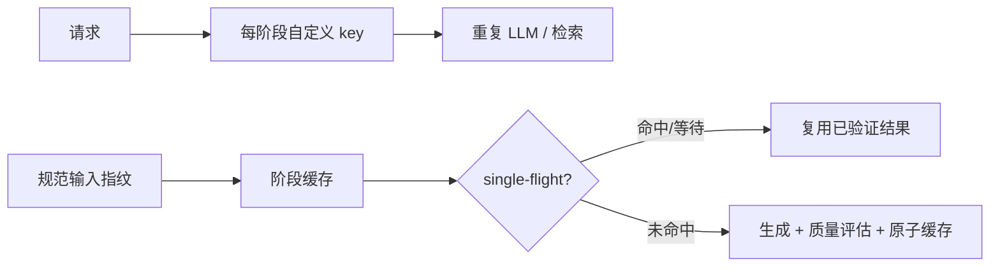

**局部性与杠杆**

缓存语义由一个模块负责，调用者只声明产物种类和输入版本；修复一个命中错误即可影响大纲、单元和补救课程。

**测试影响**

验证稳定序列化、提示词/模型变更失效、并发十次只调用一次 provider、TTL 到期、缓存截断/损坏恢复和不同来源包不互相命中。

---

### 候选 H：提供方感知调度、可观测性与失败预算

**推荐强度：Strong（P2）**

**问题**

目前 `generate-all` 只限制 1–4 的并发和启动间隔；提供方重试独立于队列执行，单请求可等待 300 秒。没有统一记录阶段耗时、token、重试、缓存命中、质量失败或 fallback 原因，因而无法判断慢在检索、模型还是发布。

**解决方案**

建立调度模块，将并发数、每分钟请求/token 预算、最大排队时间、每阶段 timeout、指数退避、`Retry-After`、熔断和取消统一管理。每个 `GenerationJob` 记录：请求 id、模型、来源数、缓存命中、阶段延迟、输入/输出 token（若提供方提供）、重试次数、质量结果和发布结果。

CLI 只显示进度摘要，详细记录写入本地日志；新增 `fc generation status`、`fc generation retry <jobId>` 与 `fc generation metrics` 作为后续候选命令。错误必须区分：配置、认证、限流、临时网络、提供方 5xx、结构失败、质量失败、发布失败和运行器失败。

**当前/目标图**

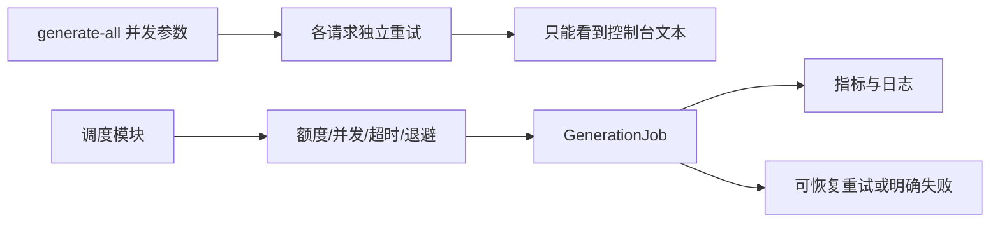

**局部性与杠杆**

限流和失败语义不再散落在 provider、CLI 与单元生成实现中；同一适配器可用于批量生成、补救与未来后台生成。

**测试影响**

用虚拟时钟和 fake provider 验证 429、`Retry-After`、5xx、永久 4xx、取消、熔断恢复、队列公平性和指标聚合。

---

### 候选 I：将审计深化为测试体系与发布门槛

**推荐强度：Strong（P3）**

**问题**

当前 `tests/` 中存在依赖真实 API、会吞掉错误或会写入文件的脚本，且无 `npm test`。这不适合作为回归门槛，也无法安全验证模型、网络、状态和文件异常。

**解决方案**

采用 Vitest（或等价 TypeScript 测试运行器）建立明确脚本：`test`、`test:unit`、`test:integration`、`test:golden`、`test:smoke`。真实提供方调用只保留为手工 smoke，不纳入默认 CI。所有默认测试使用临时目录、固定时钟和 fake provider。

将 `fc audit` 拆为可组合规则集：结构规则、教学规则、来源规则、运行器规则、发布规则。CLI 的 `--strict` 应以发布规则决定 exit code；质量评分应解释分数构成，不因单纯“无 error”而显示为通过。

**当前/目标图**

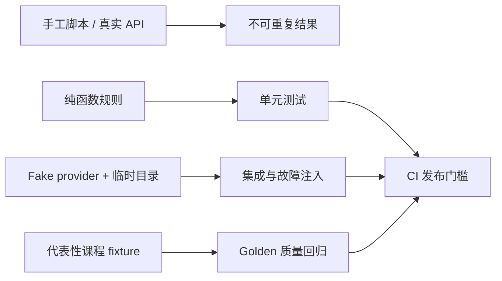

**局部性与杠杆**

测试跨越真实模块接口而不是私有细节。提示词、提供方和文件系统替换时，契约测试能及早指出行为变化。

**测试影响**

见第 7 节的完整测试矩阵；每一个 P0 重构都必须先拥有失败复现测试，再替换实现。

---

## 5. 优先级路线图

### P0：数据安全、发布一致性与结构化验证

**目标：宁可明确失败，也不发布损坏、占位或覆盖学习者成果的内容。**

| 工作项                                                                     | 依赖         | 完成定义                                                                     |
| -------------------------------------------------------------------------- | ------------ | ---------------------------------------------------------------------------- |
| 增加`GenerationJob`、`UnitArtifact`、`ArtifactManifest` 概念和状态机 | 无           | 任意生成均有 job id、阶段状态和可读失败原因。                                |
| 引入严格结构化输出接缝                                                     | LLM 适配器   | 合法输出不经过正则清洗；非法输出不能被写为`published`。                    |
| 原子文件写入与计划锁                                                       | 发布协调模块 | 注入中断后旧文件仍可读；并发写入不存在半个 JSON。                            |
| 保护`solution.*`                                                         | 发布协调模块 | 重复`start`/`generate-all` 保持学习者答案不变；仅显式 reset 可覆盖。     |
| 替换基于文案的 fallback 判断                                               | 状态机       | `offline`/`degraded`/`failed` 由 manifest 状态判断，不依赖中文字符串。 |

**P0 验收指标**

- 100% 的已发布单元拥有 manifest、输入版本、质量报告和产物 hash。
- 结构化无效、质量失败或发布失败的单元 0 个被标记为 `published`。
- 注入 100 次写入中断/异常时，旧计划和学习者答案均可读取，恢复后没有半写 JSON。
- 在已有答案的目录重复执行生成，答案 hash 不变；使用显式 reset 才发生变化。

### P1：教学质量、来源可信度与练习可运行性

**目标：让“可学习、可评估、可解释”成为正式发布条件。**

| 工作项                        | 依赖           | 完成定义                                                      |
| ----------------------------- | -------------- | ------------------------------------------------------------- |
| 学习目标图与目标映射          | P0 artifact    | 每个内容、题目、测试、项目里程碑至少关联一个目标。            |
| `SourcePack` 与 lesson 引用 | 检索适配器     | 每项外部事实有来源、时间和 hash；不可信片段不进入指令通道。   |
| 发布质量评估                  | 目标图、来源包 | 目标覆盖、题目误解标签、项目对齐和结构规则同时产出报告。      |
| 参考解答实跑                  | 运行器契约     | 每个`published` 练习的参考解答通过其全部验证测试。          |
| 受控执行模式                  | 运行器适配器   | 明确 trusted/restricted/remote 语义，默认模式不继承敏感环境。 |

**P1 验收指标**

- 代表性课程集的所有正式单元均通过目标覆盖和来源规则。
- 100% 正式练习的参考解答通过编译/解释与全部验证测试。
- 每道选择题至少具有一个可说明的目标或误解标签；每道短答题拥有 rubric。
- 任何来源不可用时，作业保留明确原因并进入重试/离线流程，而非虚构引用。

### P2：吞吐、成本与可观测性

**目标：在 P0/P1 发布通过率不下降的前提下减少重复调用与等待。**

| 工作项                          | 依赖        | 完成定义                                                        |
| ------------------------------- | ----------- | --------------------------------------------------------------- |
| 规范 cache key 与 single-flight | P0 job/版本 | 同一输入只生成一次；模型、schema、提示词或来源变化必定失效。    |
| 阶段缓存与精简评审              | P1 质量评估 | 评审传输问题清单，避免完整正文重复输出。                        |
| 提供方感知调度                  | job 指标    | 限流、退避、取消和熔断受同一调度器控制。                        |
| 指标与基准样本                  | 测试体系    | 能按阶段比较 p50/p95 延迟、缓存率、重试率、token 和发布成功率。 |

**P2 验收指标**

- 对相同代表性课程集，发布质量通过率不低于 P1 基线。
- 在缓存可用的重复请求中，不发生额外 LLM 调用；相同并发请求只保留一次飞行中的作业。
- 相比 P1 基线，单位单元 p95 生成时延目标降低至少 30%，平均模型输入/输出 token 目标降低至少 25%。若做不到，保留质量优先策略并记录原因，不以降低门槛换指标。
- 每次失败可归因到统一错误分类，且可从 job 记录重试或诊断。

### P3：模块深度、测试体系和长期演进

**目标：让新增模型、语言、来源和终端体验不再放大维护成本。**

| 工作项                                     | 依赖     | 完成定义                                                |
| ------------------------------------------ | -------- | ------------------------------------------------------- |
| 深化课程生成、质量评估、发布协调和调度模块 | P0/P1/P2 | CLI 不再包含生成规则、原子发布规则或质量实现。          |
| runner/检索/状态适配器契约                 | P1       | 新增语言或来源只增加一个适配器及其契约测试。            |
| Vitest、fixture 与 CI 门槛                 | P0 测试  | 默认`npm test` 完全离线、确定性且不触碰用户学习目录。 |
| 课程 golden 集                             | P1       | 对不同学习画像、语言和项目类型做质量回归与趋势对比。    |

---

## 6. 建议的模块接缝（候选，不是本次代码变更）

本报告不改变任何公共接口或类型。以下仅用于后续设计讨论，避免在实施时把复杂度重新散回 CLI 和提示词实现。

| 模块         | 对外接口应表达什么                           | 内部实现应隐藏什么                           | 适配器候选                             |
| ------------ | -------------------------------------------- | -------------------------------------------- | -------------------------------------- |
| 课程生成模块 | 提交请求、查询/恢复作业、获取已验证 artifact | 阶段提示词、模型调用、repair、缓存、阶段重试 | OpenAI-compatible LLM、fake LLM        |
| 质量评估模块 | 评估 artifact 并返回可解释报告               | 结构、目标、来源、题目和运行器规则           | 本地规则、可选评审模型                 |
| 发布协调模块 | 发布/回滚 artifact，保护学习者文件           | 临时文件、manifest、锁、版本和恢复           | 文件系统、内存测试存储                 |
| 检索模块     | 根据目标返回来源包                           | HTTP、排序、缓存、截断、注入防护             | Wikipedia、Tavily、官方文档检索        |
| 运行器模块   | 执行验证并返回统一结果                       | 语言命令、临时目录、超时、环境限制           | TypeScript、Python、Bash、Rust、Piston |
| 调度模块     | 提交带预算的作业                             | 并发、速率、退避、取消、熔断                 | 提供方策略、虚拟时钟测试实现           |

深度判断标准：如果删除其中一个模块后，重试、缓存、发布或质量规则重新出现在多个调用者中，该模块就在创造杠杆；如果只是转发参数，则不要引入额外接缝。

---

## 7. 测试与验证矩阵

| 层级        | 场景                                                 | 必须验证的结果                                          |
| ----------- | ---------------------------------------------------- | ------------------------------------------------------- |
| 结构化生成  | JSON 缺字段、代码含花括号、截断、无效枚举            | 不发布；产生字段级错误和可恢复 job。                    |
| 大纲        | 重复 id、错误路由、空目标、缺项目                    | 在保存前被 schema/质量规则拒绝或明确标为 outline 问题。 |
| 发布        | 写入异常、磁盘已满模拟、进程中断                     | 原文件完整、临时文件可恢复、manifest 无伪成功。         |
| 学习者保护  | 有/无`solution.*`、重复 start、显式 reset          | 默认不覆盖；reset 有明确行为和可审计记录。              |
| 缓存        | 稳定 key、模型/提示词/来源变更、并发同请求、损坏文件 | 正确命中/失效；single-flight；损坏后安全重建。          |
| 检索        | 官方来源、空结果、超时、恶意指令片段                 | 来源等级正确；失败可恢复；不可信文本不能改变生成规则。  |
| 教学质量    | 目标缺覆盖、错误前置、重复干扰项、空 rubric          | 发布质量报告准确失败并指出修复方向。                    |
| 练习        | 参考解答成功、语法错误、入口错误、边界测试缺失       | 只有通过实跑与教学规则的练习可正式发布。                |
| 运行器      | 超时、子进程错误、空 JSON 输出、临时目录清理         | 统一错误分类、资源限制和无泄漏清理。                    |
| 调度        | 429、5xx、`Retry-After`、取消、熔断、队列公平      | 不重试永久配置错误；临时错误遵从预算；指标可读。        |
| Golden 回归 | 初学者/进阶者、不同语言、项目/补救课程               | 质量分、发布率、目标覆盖、延迟和成本趋势不回退。        |

### 建议的命令层级

| 命令                         | 目的                                   | 是否访问真实网络   |
| ---------------------------- | -------------------------------------- | ------------------ |
| `npm test`                 | 纯函数、契约、故障注入                 | 否                 |
| `npm run test:integration` | fake provider + 临时目录的端到端流程   | 否                 |
| `npm run test:golden`      | 固定来源包与固定模型响应的课程质量回归 | 否                 |
| `npm run test:smoke`       | 手工验证实际提供方、检索和远程运行器   | 是，默认 CI 不运行 |

---

## 8. 实施顺序与迁移控制

1. **先建测试保护网。** 为当前 fallback、覆盖 `solution.*`、半写 JSON、解析失败和缓存键缺失写出失败复现；不先大规模移动文件。
2. **建立新 artifact/manifest 与原子发布路径。** 旧 `plan.json` 可继续读取；新生成单元逐步写 manifest，不要求一次迁移所有历史课程。
3. **切换结构化输出。** 在 feature flag 下让新旧解析并行记录差异；只让通过新质量门槛的结果走新发布路径。
4. **接入教学质量与参考解答验证。** 先以 warning 运行并收集代表性课程基线，再把关键规则升级为发布阻断。
5. **迁移缓存和调度。** 先只记录规范 key 与指标，再启用 single-flight、阶段缓存和动态并发；每一步比较质量通过率。
6. **最后收缩 CLI 和 `pipeline.ts`。** 当新模块的接口已被测试覆盖后，再删除旧实现，避免双写长期存在。

### 兼容性约束

- 继续读取现有 `learner.json`、`plan.json`、`state.json`；若增加 schema version，必须提供显式迁移与备份。
- 现有 `.fuckcolloge/lessons/`、`exercises/` 和用户答案不应被批量重写。
- 初期保留离线种子课程，但在 CLI 和课程文件中清楚展示 `offline` 状态，避免与正式生成结果混淆。
- `--concurrency` 与 `--stagger-ms` 可暂时兼容，但实际生效值应由调度模块报告，而不是静默裁剪。

---

## 9. 风险与取舍

| 风险                           | 错误做法                         | 建议取舍                                                               |
| ------------------------------ | -------------------------------- | ---------------------------------------------------------------------- |
| 为了速度删除评审阶段           | 直接从三阶段降为一次调用         | 用阶段缓存、精简评审输出和质量驱动跳过修复；发布评估始终保留。         |
| 为了离线可用发布占位课         | 把 fallback 当作完成课程         | 允许明确标识的离线种子，但不标记为`published`。                      |
| 为了“隐藏测试”在本机藏文件   | 依赖路径不可见                   | 本地模式只用于学习反馈；真正隐藏测试必须转入远程受控运行器。           |
| 为了减少文件复杂度继续直接覆盖 | 认为同步`writeFileSync` 就安全 | 同步不等于原子或可恢复；保留 manifest、临时文件和 rename。             |
| 为了抽象而增加很多薄模块       | 每个函数各建一层转发             | 只在真实变化点建立接缝；一个适配器时保持内部实现，两个适配器后再固化。 |
| 为了质量完全依赖评审模型       | 让模型给自己打分后直接发布       | 先用确定性规则、执行验证和来源记录，再把模型评审作为补充信号。         |

---

## 10. 初版建议的下一步（历史）

在真正开始代码重构前，建议先确定 P0 的产品决策：

1. `solution.*` 与 starter 模板的最终目录/命名策略；
2. `offline`、`degraded` 与 `failed` 对学习者的展示和可继续学习规则；
3. 是否为正式课程引入远程受控运行器，以及其成本与隐私边界；
4. 代表性课程 golden 集包含哪些目标、学习者水平、语言和项目类型；
5. 质量发布门槛中哪些规则从第一天起阻断发布，哪些先以 warning 收集基线。

在这些决策明确后，应从“原子发布 + 学习者答案保护 + 结构化输出”的 P0 垂直切片开始；它能同时减少数据损失、解析脆弱性和静默低质发布，为后续教学质量与性能优化提供可靠地基。

---

## 11. 当前实施进度（2026-07-14）

本建议中的首批 P0/P2 垂直切片已经落地，且没有降低正式发布质量门槛：

| 已落地能力 | 当前实现 | 可验证结果 |
| ---------- | -------- | ---------- |
| 结构化生成 | 大纲、单元和评估只接受指定工具调用与 schema 校验 | 普通文本或猜测式 JSON 不会进入正式产物 |
| 安全发布 | 逐文件原子写入、发布锁、写前恢复日志、artifact manifest、`solution.*` 默认保护 | 重复 start/预生成不会覆盖学习者答案；中断发布可回滚旧计划和旧文件 |
| 可恢复作业 | durable generation job、父子重试链、阶段 checkpoint、输入 hash | 输入未变化可恢复；输入变化拒绝错误复用 |
| 计划一致性 | `LearningPlan.revision`、单写者锁、乐观并发检查 | 旧 revision 无法覆盖新计划 |
| 提供方稳定性 | 错误分类、超时、请求速率预算、退避、熔断和队列取消 | 临时错误受预算重试，永久错误快速失败 |
| 可观测性 | p50/p95、token、重试、缓存复用和 Critique 跳过计数 | `fc generation metrics` 可直接汇总 |
| 风险自适应生成 | Draft 本地评分；高置信才跳过 Critique，低置信继续三阶段 | 最终结构化质量门与参考解答实跑始终保留 |
| 可信来源包 | schema 复验、URL 规范化去重、可信度/相关性排序、提示注入清洗 | 坏缓存被丢弃；正式生成只接收可验证来源 |
| 检索故障恢复 | 24 小时新鲜缓存 + 30 天已验证应急快照 | 提供方短暂故障可明确降级；无快照时不静默发布 |
| 官方来源恢复 | Tavily 有界重试、技术关键词识别、官方域名补充与已知官方页面兜底 | 缺少语言名的 `impl blocks` / `Result<` 等 Rust 目标仍可获得 primary 来源 |
| 来源发布追溯 | manifest 记录来源策略版本、URL、hash、可信度和新鲜度 | 可从已发布 artifact 反查生成时使用的来源版本 |
| 隔离内容预览 | `start --content-only` 与 `generate-all --content-only` | 保留完整内容质量门，跳过本地 runner，不修改计划、正式 manifest 或学习者答案 |
| 修复收敛 | assessment/citation 专用修复、objective 完整修复路由、最多三轮完整 artifact repair | 持续相似选择题可确定性转换为简答题；修复失败不会无限调用或静默发布 |
| Windows 写入韧性 | 原子 rename 对 `EPERM`、`EACCES`、`EBUSY` 有界退避 | 短暂文件占用不再直接破坏预览或发布落盘 |

### 风险自适应生成的当前/目标关系

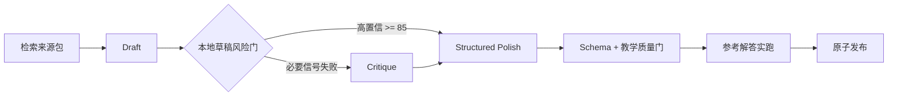

该策略不是简单删除评审阶段：长度、目标覆盖、结构、示例是必须信号，Project 还必须通过架构信号；跳过决策会记录评分和原因，便于后续用代表性课程集比较通过率、p50/p95 延迟与 token 成本。如果质量回归下降，应优先提高阈值或扩大必要信号，而不是放宽最终发布规则。

### 来源包恢复路径

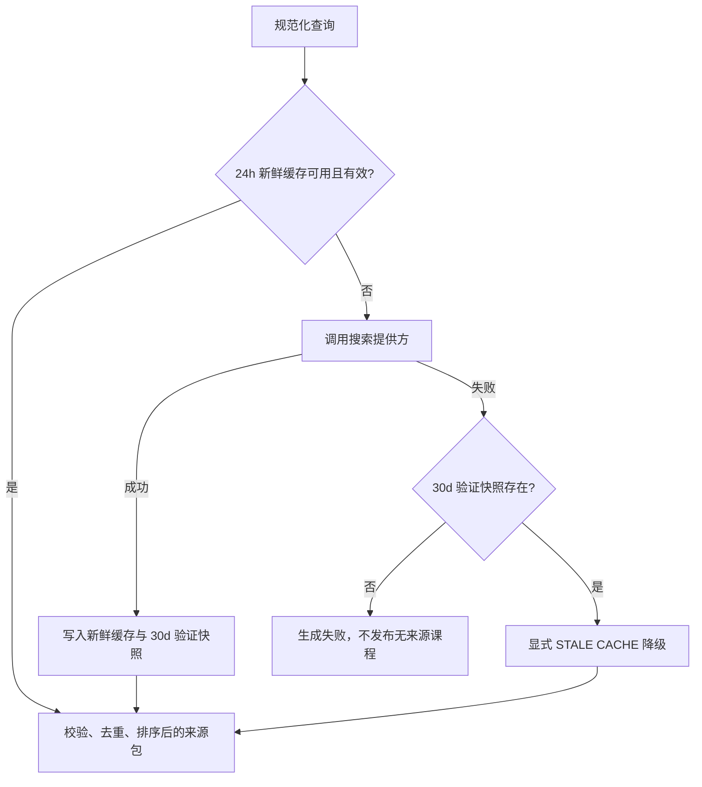

---

## 12. 候选 A～I 实施状态审计（2026-07-14）

状态定义：

- **已完成**：本轮定义的核心问题和验收路径均已实现并有自动化验证；不代表未来不能继续增强。
- **基本完成**：核心问题已解决，当前支持范围内有自动化验证；仍可能有后续增强项。
- **大部分实现**：主要链路已落地，但至少一个原建议验收条件尚未满足。
- **部分实现**：已有可用垂直切片，但关键风险或模块接缝仍未闭合。
- **未实现**：尚无可验证实现。当前没有候选处于该状态，但这不等于路线图全部完成。

| 候选 | 状态 | 已实现证据 | 尚未实现 / 未完成验收 |
| ---- | ---- | ---------- | --------------------- |
| A 深化课程生成模块、缩薄 CLI | **部分实现** | 已拆出 `generation/orchestrator.ts`、`publisher.ts`、`scheduler.ts`、`metrics.ts`、`state/planStore.ts`、提供方错误与指标模块 | `pipeline.ts` 约 1,416 行、`cli.ts` 约 1,149 行；大纲、单元、补救和评估仍集中在 pipeline，CLI 仍包含批量编排与部分业务流程；尚无统一 `submit/query/resume` 深模块接口和内存适配器契约 |
| B 结构化输出取代正则与 JSON 清洗 | **基本完成** | 大纲、单元、修复和评估均强制指定工具调用并由 Zod schema 校验；普通文本被拒绝；assessment/citation 使用专用有界修复，objective 错误路由到可修改正文的完整修复，通用 artifact repair 最多三轮并携带上轮反馈 | 目前只验证 OpenAI-compatible 工具调用路径；尚无“不支持工具调用提供方”的严格单 JSON codec 适配器与契约测试 |
| C 发布事务、原子持久化与答案保护 | **已完成** | JSON、文本和缓存逐文件临时写入、fsync、rename；发布锁、计划 revision、`publishing` manifest、目标/备份 hash、base/target revision、CLI 启动扫描、安全完成、确定性回滚、未知修改拒绝、答案保护和显式 reset 均已实现；Windows rename 瞬时占用可有界重试 | 跨目录发布采用可恢复事务而非底层单次 rename，这是明确设计约束；后续可增加恢复 UI，但不影响本轮验收 |
| D 可验证教学质量闭环 | **基本完成** | 精确目标覆盖、知识目标图、先修路径、Project 前置目标综合使用、引用、三类测试、事实声明门、参考解答实跑和 Quiz 诊断规则均已实现；重复/近似/泛化干扰项、重复 misconception、未知目标和未评估目标会阻断发布 | 代表性 golden 集仍只有单一 fixture，尚不能证明不同画像与语言均不回退；这是测试基线扩展，不阻塞本轮知识图与诊断规则验收 |
| E 可靠来源包、引用与检索防护 | **基本完成** | Source 包含 URL、发布者、时间、hash、可信度、新鲜度；实现 schema 复验、去重排序、注入清洗、24h/30d 双层缓存、Tavily 瞬时故障重试、官方域名补充、已知技术官方页面兜底、lesson 引用、stale 审计、manifest 来源版本，以及“一 primary 或两独立 publisher”的声明级支持门 | 来源尚未声明适用 objective；官方页面路由目前只覆盖已知 Rust/Tokio/Axum/SQLx/Redis 主题，尚不是通用生态适配器；语义真实性仍依赖结构化引用关系，不宣称已完成通用自然语言事实证明 |
| F 练习可运行性与执行隔离 | **部分实现** | `referenceSolution` 不发布给学习者，并在临时目录通过生成测试；Python 测试数据使用 Base64 跨语言传递并支持预期异常；本地 runner 使用最小环境和超时；非本地语言可走 Piston | 本地运行仍不是 OS/容器沙箱，无法阻止文件读取、网络或子进程；未拆分可见测试与远程验证测试；Piston 缺少完整错误分类、持久运行时缓存和契约 fixture |
| G 版本化缓存、请求合并与质量守恒提速 | **大部分实现** | 规范序列化、模型/提示词/schema/来源版本 key、阶段缓存、single-flight、TTL、内存上限、损坏隔离和风险驱动跳过 Critique 已实现；正式/内容预览最终缓存隔离，Pass 阶段缓存可共享 | Critique 仍输出整篇扩写稿而非精简问题清单；磁盘缓存没有容量清理；未记录逐次失效原因；尚未用代表性课程证明 p95 降低 30%、token 降低 25% |
| H 提供方感知调度、可观测性与失败预算 | **部分实现** | 并发、RPM、阶段 timeout、Retry-After、错误分类、重试、熔断、取消、job/checkpoint、p50/p95、token 与缓存指标已实现 | 缺 token-per-minute 预算、最大排队时间与公平性；阶段指标仍以整体 generation 为主，未拆 retrieval/draft/critique/final；job 未持久化模型名、提供方 request id 和质量失败分类 |
| I 审计深化为测试体系与发布门槛 | **部分实现** | 已有离线 `test`、`test:unit`、`test:integration`、`test:golden`、手工 `test:smoke`；`fc audit --strict` 可让 warning 返回非零；当前默认回归集 62 项，覆盖预览隔离、来源恢复、修复路由、题目收敛和 Windows 原子写入 | audit 仍是单文件规则集合，尚未拆成结构/教学/来源/运行器/发布规则模块；分数缺少规则权重明细；没有 CI 工作流；golden 集未覆盖画像、语言、Project 和 remediation 组合 |

### 12.1 P0～P3 完成度结论

| 阶段 | 当前判断 | 不能宣称完成的原因 |
| ---- | -------- | ------------------ |
| P0 数据安全与结构化验证 | **完成（当前要求）** | CLI 启动扫描、hash/revision 验证、安全完成/回滚/标记失败均已验证；非工具调用提供方 codec 属于后续适配器扩展，不阻塞当前唯一提供方路径 |
| P1 教学质量、来源与运行器 | **大部分完成** | 事实声明核验、知识目标图、Project 综合使用和题目诊断度均已完成；真正受控的本地执行隔离和多样化 Golden 基线仍未闭合 |
| P2 吞吐、成本与可观测性 | **功能大部分存在，指标未验收** | 缺代表性真实基线，无法证明 p95/token 目标；调度缺 token 预算和排队上限 |
| P3 模块深度与测试体系 | **部分完成** | pipeline/CLI 仍过宽，audit 未模块化，无 CI，多样化 golden 不足 |

### 12.2 本轮新增完成项

- artifact manifest 新增 `sourcePolicyVersion` 和来源快照，记录 source id、URL、发布者、抓取时间、hash、可信度与 freshness。
- 旧 schemaVersion 1 manifest 在缺少来源字段时仍可读取，新增集成测试锁定向后兼容。
- 因此候选 E 的“manifest 记录来源版本”由未实现更新为已实现；候选 E 仍因 objective 适用性和事实交叉核验而保持“大部分实现”。
- 发布事务新增写前恢复日志：备份旧 plan 与所有将被覆盖的目标文件，`publishing` manifest 持久化恢复清单。
- 成功发布会清理恢复目录；运行时异常立即回滚；崩溃遗留可由 `fc generation recover` 扫描并恢复，同时更新 manifest 和 generation job。
- 候选 C 因此从“大部分实现”提升为“基本完成”；仍保留自动启动扫描和底层跨目录原子性的限制说明。
- 发布恢复日志现在同时记录每个目标的旧/新 hash、base/target plan revision 和预期 artifact 清单。CLI 启动扫描后，恢复器可区分安全完成、确定性回滚和未知修改三种状态。
- 事实声明核验已落地：citation claim 必须逐字存在于 lesson；每个声明需要一个 primary 来源或两个独立 publisher；不满足时在模型调用前快速失败，或在修复仍失败后写入 generation job 的失败 quality report。
- 因此用户指定的 P0 发布恢复协调器与 P1 事实声明核验已完成；P1 整体路线仍包含运行器隔离、知识图和多样化质量基线等后续工作。
- Quiz 诊断规则已落地：至少三个唯一选项、禁止泛化干扰项、目标映射必须有效且覆盖全部 objectives，同时检查题干、解释、misconception 与 rubric 的最低教学信息量。
- 知识目标图已落地：新生成计划要求全局唯一 objectives，后续单元只能引用更早目标；缓存中的旧无图计划自动失效并重新生成。Project 必须综合至少两个前置单元，且每个声明前置目标都由 milestone 实际使用。
- 高级题目诊断已落地：选项双元组相似度阻止伪差异；每个错误选项通过 `distractorRationales` 映射唯一 misconception 与纠正反馈，缺失、重复或错配均阻断发布。
- 因此用户指定的“知识目标图与题目诊断度规则”以及“Project 对前置目标综合使用”两项均已完成。

---

## 13. 下一轮优化顺序

1. **P1：定义运行器安全模式。** 明确 `trusted-local`、`restricted`、`remote`，避免把最小环境变量误称为沙箱。
2. **P2：拆分阶段指标与 token 预算。** 记录 retrieval/draft/critique/final/validation/publication，增加最大排队时间和 token-per-minute 预算。
3. **P3：继续深化生成模块。** 先提取 UnitGeneration、RemediationGeneration 和 Assessment 三个深模块，再缩薄 CLI；同时拆分 audit 规则并增加 CI 与多样化 golden 集。
4. **P1 来源增强：通用官方文档适配器。** 把当前已知 Rust/Tokio/Axum/SQLx/Redis 页面兜底扩展为按语言生态声明、版本和 objective 路由的适配器，降低严格事实门对付费通用搜索的依赖。
5. **P1/P3：扩展 Golden 矩阵。** 覆盖初学者/进阶者、TypeScript/Python/Rust、普通单元/Project/remediation，验证知识图与诊断规则不会对特定课程类型过拟合。

---

## 14. DeepSeek V4 Pro 真实生成回归（2026-07-14）

本轮使用 `deepseek-ai/DeepSeek-V4-Pro` 对 `unit-1` 执行真实 `npm run dev start`。该过程验证了建议文档中“质量门不降低、修复局部化、参考解答实跑、失败不发布”的组合链路。

### 新增实现

- assessment repair 最多两轮，只重建 Quiz 与 objective coverage；最后一轮允许把持续冲突的选择题转为短答题。
- citation repair 独立成专用工具，claim 与 source ID 由动态 enum 限制，禁止模型改写 lesson 事实或虚构来源。
- objective coverage evidence 在合并前归一化为 lesson 中的逐字证据，并自动过滤无效 assessment ID。
- 对引用声明执行确定性支持分组；没有达到“一 primary 或两独立 publisher”的声明不会静默通过。
- Python runner 使用 Base64 传递 JSON 测试数据，避免嵌套 JSON、引号和换行破坏生成的 `test.py`；同时支持预期异常测试。

### 真实验收数据

| 指标 | 结果 |
| ---- | ---- |
| 作业状态 | `published` |
| 总耗时 | 82,551 ms |
| Provider 调用 | 2 |
| Provider 重试 | 0 |
| Prompt tokens | 9,255 |
| Completion tokens | 4,242 |
| Total tokens | 13,497 |
| publication | 56 ms |

该结果证明当前故障已经从“长超时且不可解释”收敛为可观测、可分类、可局部修复的生成流程；但它只是单个 Python 普通单元的成功样本，不能替代跨语言、Project 与 remediation 的代表性性能和教学质量回归。
